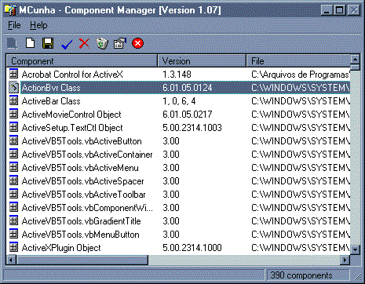



## MCunha \- Component Manager

### Description

This application manager (registry, unregistry, send to recycled bin and show properties) of all components activex and dll's in your machine.

In this version, only executable is avaliable, if need go to http://www.mcunha98.cjb.net and download the file including runtime files.

Now, i include the 

----

SOURCE CODE *** and

help file for understand with use.
 
### More Info
 

             |
---                |---
**Submitted On**   |2000-08-12 10:21:20
**By**             |[Mauricio Cunha](https://github.com/Planet-Source-Code/PSCIndex/blob/master/ByAuthor/mauricio-cunha.md)
**Level**          |Advanced
**User Rating**    |4.8 (19 globes from 4 users)
**Compatibility**  |VB 6\.0
**Category**       |[Complete Applications](https://github.com/Planet-Source-Code/PSCIndex/blob/master/ByCategory/complete-applications__1-27.md)
**World**          |[Visual Basic](https://github.com/Planet-Source-Code/PSCIndex/blob/master/ByWorld/visual-basic.md)
**Archive File**   |[CODE\_UPLOAD88928122000\.zip](https://github.com/Planet-Source-Code/mauricio-cunha-mcunha-component-manager__1-10596/archive/master.zip)

